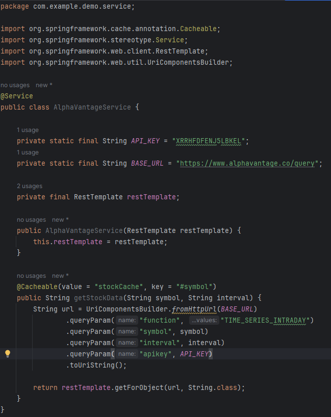
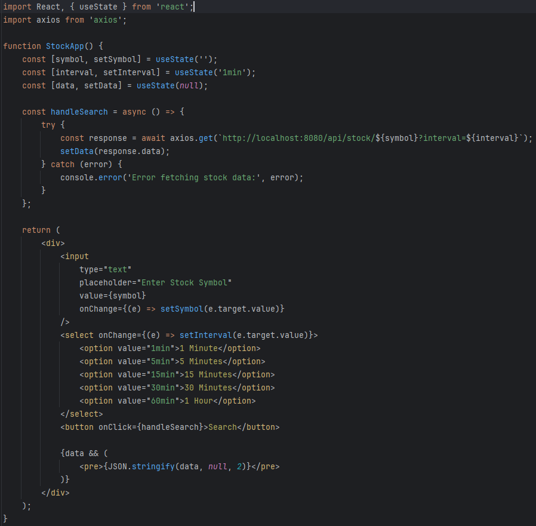
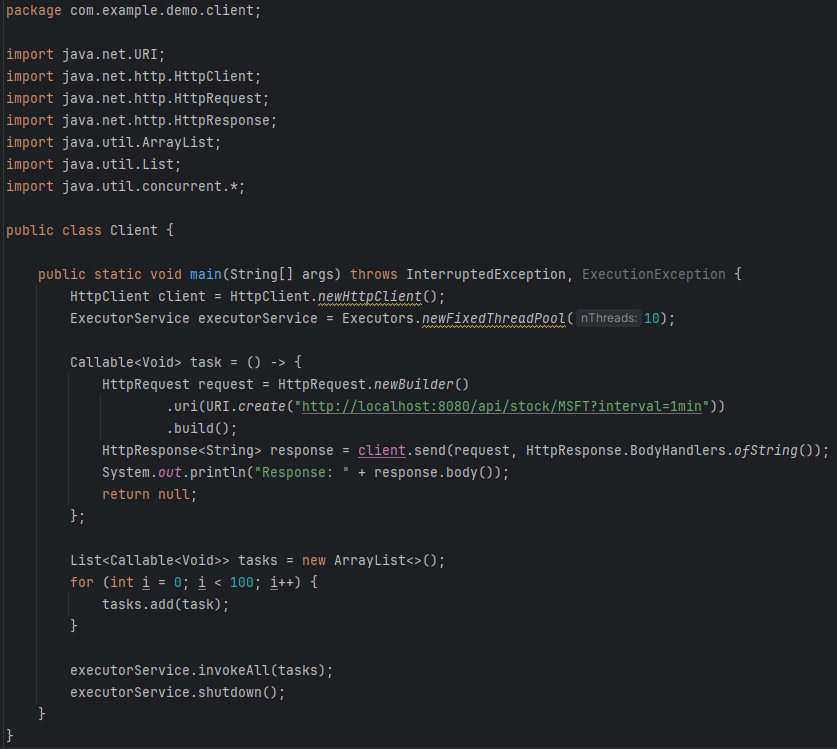
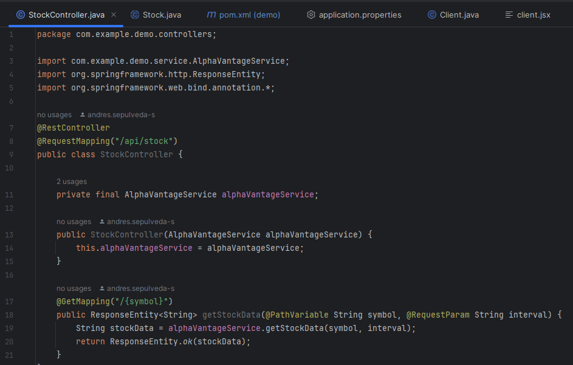
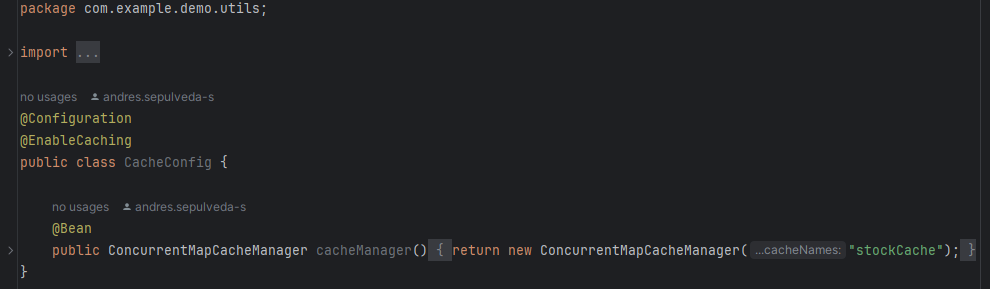
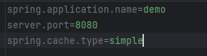

# Parcial-ARSW

## Enunciado

Antes de iniciar cree un repositorio Github.
Su compañía lo ha seleccionado para construir una
aplicación que demuestre una simple arquitectura
distribuida web soportada en servicios REST desplegada
en AWS o Azure con CI/CD para uno de los clientes más
importantes.
Así, han decidido que usted debe construir una aplicación
para consultar el mercado de valores de las acciones
negociadas en Bolsa. La aplicación recibirá el
identificador de una acción, por ejemplo “MSFT” para
Microsoft y deberá mostrar el histórico de la valoración
intra-día, diaria, semanal y mensual. Para esto utilice el
API gratuito de https://www.alphavantage.co/
documentation (Puede crear una cuenta para obtener la
llave para realizar consultas). Se le pide que su diseño
esté pensado para poder conectar otros proveedores de
servicio. Piense cómo estructurar su programa para
satisfacer este requerimiento.
Para visualizar los datos debe utilizar una librería de
gráficos que pueda cambiar su representación
dependiendo de cual se seleccione.

1. El cliente Web debe ser un cliente asíncrono escrito
en REACT.
2. El servidor escrito en Spring servirá como un gateway
para encapsular llamadas a otros servicios Web
externos.
3. La aplicación debe ser multiusuario.
4. Todos los protocolos de comunicación serán sobre
HTTP.
5. Los formatos de los mensajes de intercambio serán
siempre JSON.
6. La interfaz gráfica del cliente debe ser los más limpia y
agradable posible.
7. Puede integrarse a su proyecto de IA desarrollado en
sesiones anteriores.
8. Todos los API servicios y Front deberán estar
desplegados en AWS o AZURE (En caso de utilizar AWS
no es necesario emplear CI/CD)
9. Debe construir un cliente Java que permita probar las
funciones del servidor fachada. El cliente utiliza simples
conexiones http para conectarse a los servicios. Este
cliente debe hacer pruebas de concurrencia en su
servidor de backend. El cliente es una aplicación de
consola, es decir sin interfaz gráfica.
10. La fachada de servicios tendrá un caché que permitirá
que llamados que ya se han realizado a las
implementaciones concretas con parámetros específicos
no se realicen nuevamente. Puede almacenar el llamado
como un String con su respectiva respuesta, y comparar el
string respectivo. Recuerde que el caché es una simple
estructura de datos.
U. Se debe poder extender fácilmente, por ejemplo, es
fácil agregar nuevas funcionalidades, o es fácil
cambiar el proveedor de una funcionalidad.
10. Debe utilizar maven para gestionar el ciclo de vida, git
y github para almacenar al código fuente AWS o
AZURE como plataforma de producción.

## Descripcion del diseño:

**Explicación de la Arquitectura del Proyecto:**

La arquitectura del sistema está diseñada bajo un enfoque distribuido y orientado a servicios haciendo uso de la estrcutura cliente-servidor utilizando tecnologías como React para el cliente web y Spring Boot para el servidor backend (definido por los requisitos). Esta arquitectura también actúa como gateway hacia servicios externos, permitiendo una integración desacoplada y eficiente.

Estilo de Arquitectura: **RESTful Services**.

- Componentes Principales
  
  - **Cliente Web (Frontend - React)**
    Este cliente es asincrono de manera que no se queda parado en caso de que la peticion no llegue o este mal, ademas cuanta con una interfaz moderna y agradable (o eso se intento) y consume los servicios del backend a travez de peticiones HTTP usando axios.
    Por ultimo tambien es multiusario lo que le permite manejar multipes sesiones a la vez (concurrencia).

  - **Servidor Backend (Spring Boot - Gateway)**

    El papel principal de este servidor es ser una fachada o gateway, encapsulando llamadas a servicios web externos en este caso la API "Alpha Vantage". Es por esto que cuenta con endpoints REST que reciben solicitudes del cliente React o del cliente Java para pruebas     por consola. Tambien gestiona la lógica de negocio y el enrutamiento hacia los servicios externos. Uno de los requisitos era implementar un sistema de caché simple, que evita llamadas repetidas a servicios externos con los mismos parámetros, mejorando rendimiento y     eficiencia el cual se implemento haciendo uso de un hashmap como estructura de datos.

  - **Cliente de Consola (Java)**

    El objetivo de esta clase es poder probar el comportamiento del backend de forma automatizada y sin necesidad de entrar por el cliente web, este cuenta con una prueba de concurrencia donde se simulan múltiples usuarios o peticiones simultáneas hacia los endpoints       del backend. Esta utiliza conexiones HTTP simples, enviando y recibiendo datos en formato JSON.
    
    Por motivos de tiempo no se tuvieron problemas al moemnto de conectar la API por lo que no encuentra la ruta :(.

  - **Caché en el Backend (Gateway)**

    Como ya se menciono mas arriba el servidor backend implementa una estructura de datos de tipo caché, en este caso un HashMap, donde el valor es la respuesta JSON obtenida. 

5. Despliegue

Para el despliegue se uso Azure y como solamente se utilizo un repo todos los servicios estan desplegados en el nmismo lado

Todos los componentes (frontend, backend y servicios externos si los hay) deben estar desplegados en la nube, actualmente tengo problemas con la fase de deploy pero me parece (no me dio tiempo a corregirlo) que es un tema de autenticacion. Mas abajo se adjuntan evidencias

### Despliegue + CI/CD (Azure)

### Servidor Spring

### Cliente Web (React)

### Cliente java 

### Controller para manejo de los llamados

### Manejo cache

