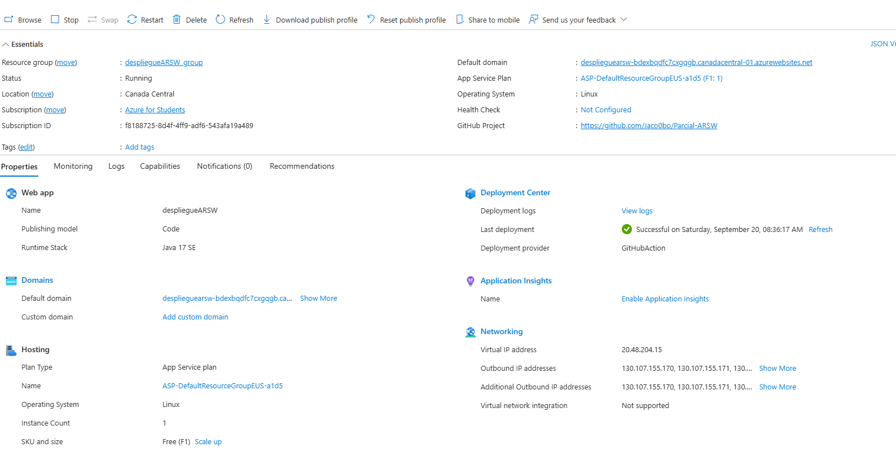
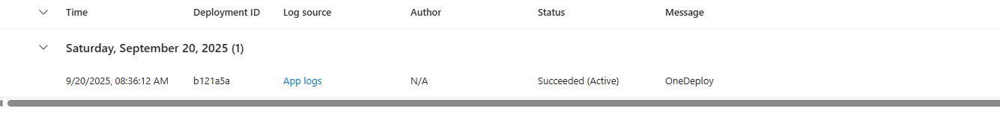
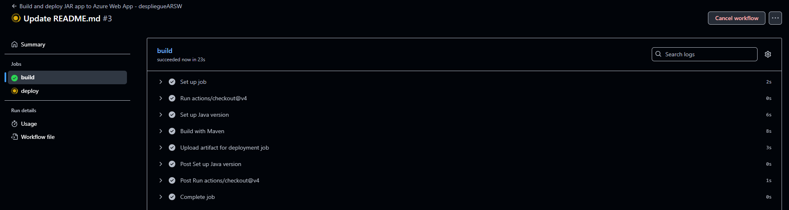

# Parcial-ARSW

## Enunciado

Antes de iniciar cree un repositorio Github.
Su compañía lo ha seleccionado para construir una
aplicación que demuestre una simple arquitectura
distribuida web soportada en servicios REST desplegada
en AWS o Azure con CI/CD para uno de los clientes más
importantes.
Así, han decidido que usted debe construir una aplicación
para consultar el mercado de valores de las acciones
negociadas en Bolsa. La aplicación recibirá el
identificador de una acción, por ejemplo “MSFT” para
Microsoft y deberá mostrar el histórico de la valoración
intra-día, diaria, semanal y mensual. Para esto utilice el
API gratuito de https://www.alphavantage.co/
documentation (Puede crear una cuenta para obtener la
llave para realizar consultas). Se le pide que su diseño
esté pensado para poder conectar otros proveedores de
servicio. Piense cómo estructurar su programa para
satisfacer este requerimiento.
Para visualizar los datos debe utilizar una librería de
gráficos que pueda cambiar su representación
dependiendo de cual se seleccione.

1. El cliente Web debe ser un cliente asíncrono escrito
en REACT.
2. El servidor escrito en Spring servirá como un gateway
para encapsular llamadas a otros servicios Web
externos.
3. La aplicación debe ser multiusuario.
4. Todos los protocolos de comunicación serán sobre
HTTP.
5. Los formatos de los mensajes de intercambio serán
siempre JSON.
6. La interfaz gráfica del cliente debe ser los más limpia y
agradable posible.
7. Puede integrarse a su proyecto de IA desarrollado en
sesiones anteriores.
8. Todos los API servicios y Front deberán estar
desplegados en AWS o AZURE (En caso de utilizar AWS
no es necesario emplear CI/CD)
9. Debe construir un cliente Java que permita probar las
funciones del servidor fachada. El cliente utiliza simples
conexiones http para conectarse a los servicios. Este
cliente debe hacer pruebas de concurrencia en su
servidor de backend. El cliente es una aplicación de
consola, es decir sin interfaz gráfica.
10. La fachada de servicios tendrá un caché que permitirá
que llamados que ya se han realizado a las
implementaciones concretas con parámetros específicos
no se realicen nuevamente. Puede almacenar el llamado
como un String con su respectiva respuesta, y comparar el
string respectivo. Recuerde que el caché es una simple
estructura de datos.
U. Se debe poder extender fácilmente, por ejemplo, es
fácil agregar nuevas funcionalidades, o es fácil
cambiar el proveedor de una funcionalidad.
10. Debe utilizar maven para gestionar el ciclo de vida, git
y github para almacenar al código fuente AWS o
AZURE como plataforma de producción.

### Despliegue + CI/CD (Azure)

